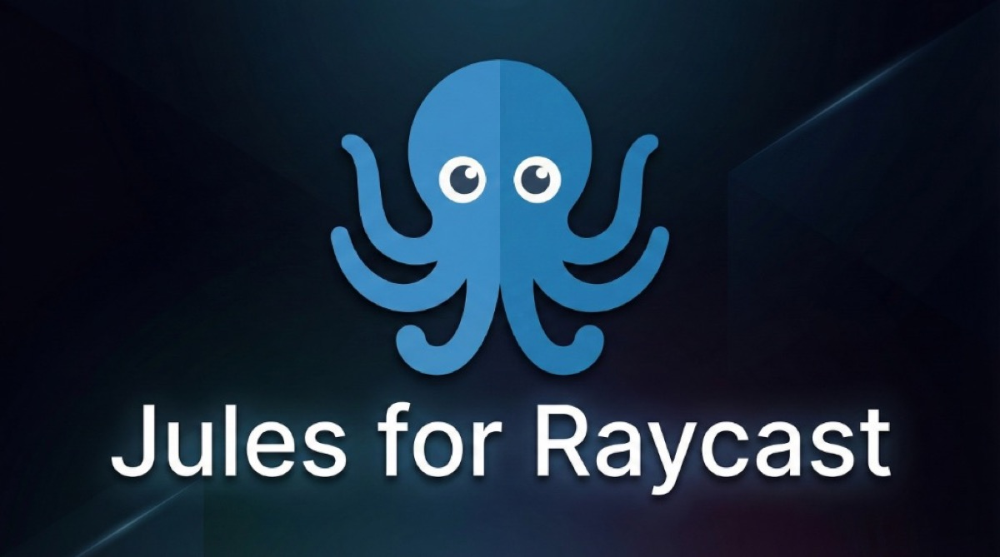
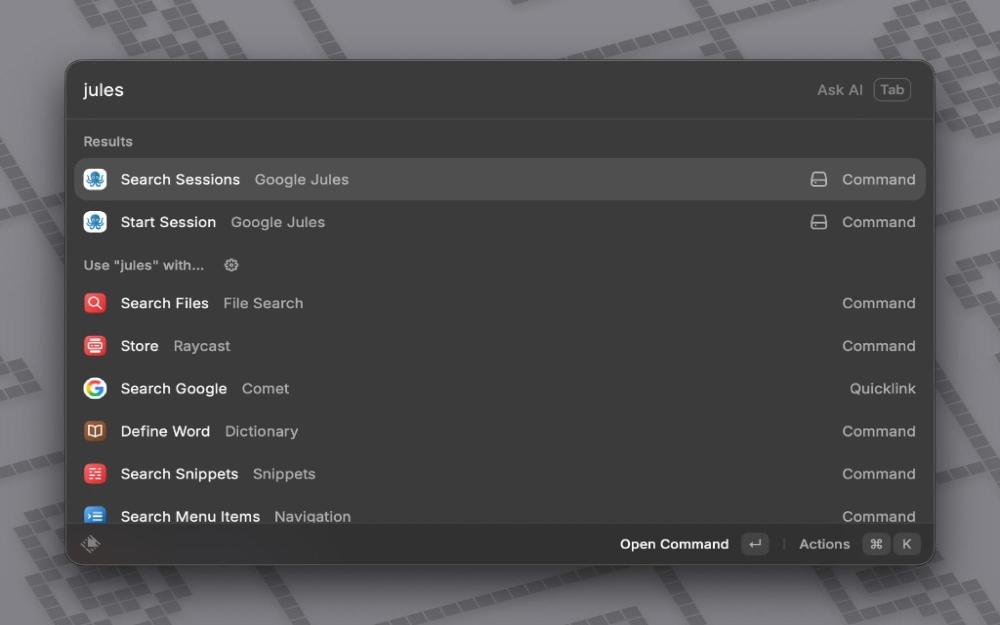
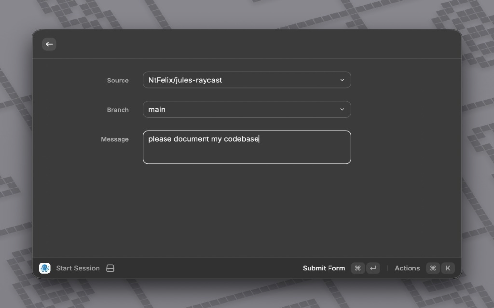
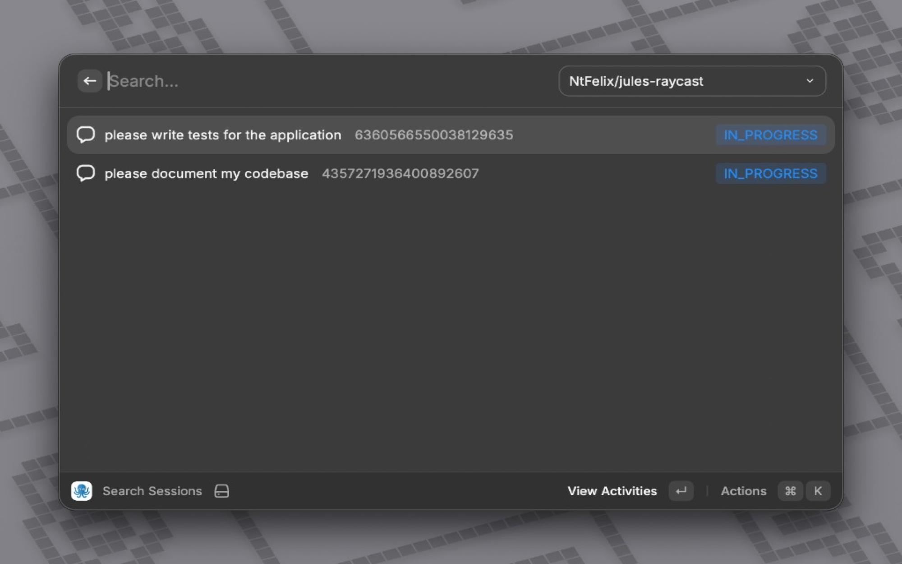
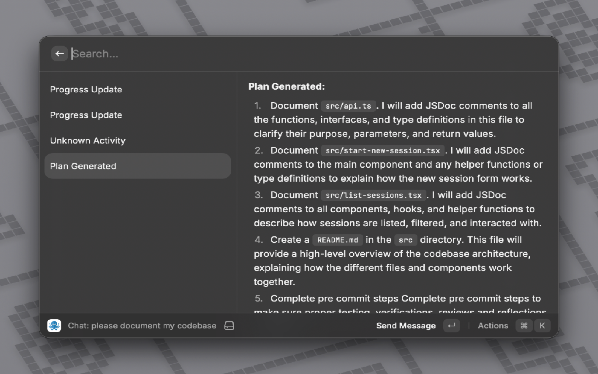
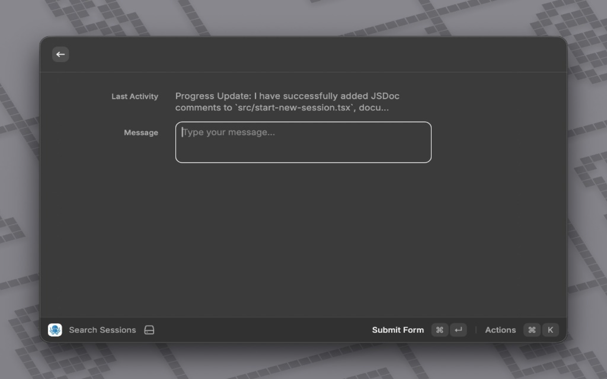

<p align="center">
  
</p>

# Jules for Raycast

Bring the power of the Google Jules coding agent directly to your fingertips with this Raycast extension. Seamlessly start new sessions and manage your coding tasks without leaving your keyboard.

## Features

- **Start New Session**: Quickly initialize a new coding session with Jules directly from Raycast.
- **Seamless Integration**: Designed to fit perfectly into your Raycast workflow.

## Installation

1. **Install Dependencies**:
   ```bash
   npm install
   ```

2. **Build the Extension**:
   ```bash
   npm run build
   ```

3. **Import to Raycast**:
   - Open Raycast.
   - Run the `Import Extension` command.
   - Select the directory containing this repository.

## Usage

Once installed, simply open Raycast and search for "Jules" to see the available commands.



- **Start New Session**: Launches the form to start a new Jules session.



- **Search Sessions**: View and manage your active sessions.



- **Session Details**: View the plan and progress of a specific session.



- **Send Message**: Communicate with Jules directly.



## Development

To run the extension in development mode:

```bash
npm run dev
```

## License

MIT